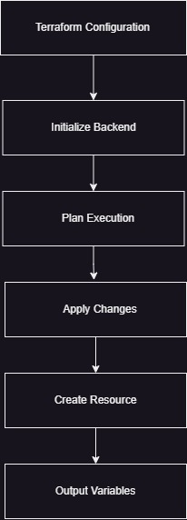

# **Minecraft Deploy with Terraform to AWS**

In this guide we will be setting up a Minecraft server on an AWS EC2 instance using Terraform. By the end of this guide you will have a Minecraft server running on an AWS EC2 instance.

### **Diagram**
---

 

 - Terraform Configuration File: This file will be used to create the infrastructure on AWS.
 - Intialize Backend: store the state information.
 - Plan Execution: Terraform will create an execution plan and compaire it to the current state and determine what changes need to be made.
 - Apply Changes: Terraform will apply the changes by creating or modifying the resource.
 - Create resources on AWS: Terraform will create the resources on AWS such as VPC, EC2 instance, and security group. Intialize the EC2 instance with userdata.sh file.
 - Output: Terraform will output the public IP address and DNS of the EC2 instance.

## **Prerequisites**

---

Before we start we will need to have the following:

- An AWS account: Sign up [here](https://aws.amazon.com/)
- The AWS CLI with account configured: Download [Guide](https://docs.aws.amazon.com/cli/latest/userguide/cli-configure-quickstart.html)
- Minecraft Java Edition of Minecraft [here](https://www.minecraft.net/en-us/download) or trial version of Minecraft from [here](https://www.minecraft.net/en-us/free-trial)
- Terraform: Download [here](https://www.terraform.io/downloads.html)
- We use WSL in order to run Terraform on Windows machines for this guide but other operating systems should work as well. [here](https://learn.microsoft.com/en-us/windows/wsl/tutorials/linux)

## **Steps**

---

Follow the steps to setup your Minecraft server on AWS EC2 instance using Terraform.

### **Setup credential for AWS CLI**

---

1. Navigate to ~/aws (or wherever you have your aws credentials)
2. Open credentials file
3. Fill in the information with your AWS credentials

```bash
[default]
aws_access_key_id = <your_access_key_id>
aws_secret_access_key = <your_secret_access_key>
aws_session_token = <your_session_token>
```

4. Save and close the file
5. Open WSL terminal
6. Run the following command to verify your credentials

    >-```aws sts get-caller-identity ```

We get the following output:
   
```bash
"Account": "000654207548",
    "UserId": "AIDAJID6SZSGMUGC5T3YA",
    "Arn": "arn:aws:iam::000654207548:user/k8s"
```


### **Create a Terraform Project**

---

1. Create a new directory for your project.
2. Create a new file named `main.tf` in your project directory.
3. Copy and paste the following code into your `main.tf` file:

```terraform
provider "aws" {
  region = "us-west-2"
}

resource "aws_security_group" "minecraft" {
  name        = "minecraft-server"
  description = "Security group for Minecraft server"

  ingress {
    from_port   = 25565  # Minecraft default port
    to_port     = 25565  # Minecraft default port
    protocol    = "tcp"
    cidr_blocks = ["0.0.0.0/0"]

  }

  ingress {
    from_port  = 22  # SSH port
    to_port    = 22  # SSH port
    protocol   = "tcp"
    cidr_blocks = ["0.0.0.0/0"]
  }

  egress {
    from_port  = 0
    to_port    = 0
    protocol   = "-1"
    cidr_blocks = ["0.0.0.0/0"]
}

  }

resource "tls_private_key" "minecraft_terra" {
  algorithm = "RSA"
  rsa_bits = 2048
}

resource "aws_key_pair" "minecraft_terra" {
  key_name   = "minecraft_terra"
  public_key = tls_private_key.minecraft_terra.public_key_openssh

  provisioner "local-exec" {
  command = "echo '${tls_private_key.minecraft_terra.private_key_pem}' > minecraft.pem"
}

}

resource "aws_instance" "minecraft" {
    ami = "ami-076bca9dd71a9a578"
    instance_type = "t2.medium"
    key_name = aws_key_pair.minecraft_terra.key_name

    tags = {
        Name = "minecraft_terra"
    }

    vpc_security_group_ids = [aws_security_group.minecraft.id]


    user_data_base64 = base64encode(file("./userdata.sh"))


}


output "public_ip" {
    value = aws_instance.minecraft.public_ip
}

output "public_dns" {
    value = aws_instance.minecraft.public_dns
}


```

### **Create a userdata.sh file**

---

**Note:** This file will be used to install dependencies and setup the Minecraft server on the EC2 instance. This file will automatically run when the minecraft server and properly shut down the server when the instance is rebooted or stopped.

Userdata.sh file will do the following:

- Update the instance
- Install Java 17, wget, git, build-essential, gcc, and tmux
- Create a new user named minecraft
- Create directories for the minecraft server and tools
- Download the minecraft server jar file
- Create a new file named `eula.txt` and add `eula=true` to the file
- Install mcrcon
- Create a new file named `server.properties` and add `enable-rcon=true` and `rcon.password=testtest` to the file
- Change ownership of the minecraft directory to the minecraft user
- Setup a systemd service for the minecraft server
  

---
**Steps**

1. Create a new file named `userdata.sh` in your project directory.
2. Copy and paste the following code into your `userdata.sh` file:

```bash
#!/bin/bash

exec > >(tee /var/log/userdata.log|logger -t userdata -s 2>/dev/console) 2>&1

sudo yum update -y
sudo rpm --import https://yum.corretto.aws/corretto.key
sudo curl -L -o /etc/yum.repos.d/corretto.repo https://yum.corretto.aws/corretto.repo
sudo yum install -y java-17-amazon-corretto-devel.x86_64
sudo yum install -y wget
sudo yum install -y git
sudo yum install -y build-essential
sudo yum install -y gcc
sudo yum install -y tmux

sudo su
sudo adduser minecraft
mkdir /opt/minecraft/
mkdir /opt/minecraft/server/
mkdir /opt/minecraft/tools/
cd /opt/minecraft/server

sudo wget -O /opt/minecraft/server/server.jar https://piston-data.mojang.com/v1/objects/15c777e2cfe0556eef19aab534b186c0c6f277e1/server.jar
echo "eula=true" | sudo tee /opt/minecraft/server/eula.txt

mkdir /opt/minecraft/tools/mcrcon
cd /opt/minecraft/tools/mcrcon
git clone https://github.com/Tiiffi/mcrcon.git
cd mcrcon

make
sudo make install

cd /opt/minecraft/server
touch /opt/minecraft/server/server.properties
cat <<EOT >> /opt/minecraft/server/server.properties
enable-rcon=true
rcon.password=testtest
EOT


sudo chown -R minecraft:minecraft /opt/minecraft/


sudo tee /etc/systemd/system/minecraft.service <<EOT
[Unit]
Description=Minecraft Server
After=network.target

[Service]
User=minecraft
Nice=5
KillMode=none
SuccessExitStatus=0 1
InaccessibleDirectories=/root /sys /srv /media -/lost+found
NoNewPrivileges=true
WorkingDirectory=/opt/minecraft/server
ReadWriteDirectories=/opt/minecraft/server
ExecStart=/usr/bin/java -Xmx1024M -Xms1024M -jar server.jar nogui
ExecStop=/usr/local/bin/mcrcon -p testtest -w 5 stop

[Install]
WantedBy=multi-user.target
EOT

sudo systemctl daemon-reload
sudo systemctl enable minecraft.service
sudo systemctl start minecraft.service

```


### **Run Terraform**
---

1. Open WSL terminal
2. Navigate to your project directory
3. Run the following command to initialize Terraform

    >-```terraform init```

4. Run the following command to create the infrastructure
5. Note: This will take a few minutes to complete

    >-```terraform apply``` 

6. You will be prompted to confirm the creation of the infrastructure. Type `yes` and press enter to continue.
7. Once the infrastructure is created you will see the following output:

```bash
Apply complete! Resources: 3 added, 0 changed, 0 destroyed.

Outputs:

public_dns = <PUBLIC_DNS>
public_ip = <IP_ADDRESS>
```

### **Connect to your Minecraft Server**
---

**Note:** You will need to wait a few minutes for the server to finish setting up before you can connect.

1. Open Minecraft Java Edition.
2. Click on Multiplayer.
3. Accept the EULA.
4. Click on Add Server.
5. Enter a name for your server.
6. Enter your instance's `<public_ip_address>:<port>` in the Server Address field.
   - In this guide we will use the default port **25565**.
7. Click on Done.
8. Click on Join Server.

You should now be connected to your Minecraft server.

### **Destroy Infrastructure**
---

1. Open WSL terminal
2. Navigate to your project directory
3. Run the following command to destroy the infrastructure

    >-```terraform destroy```

4. You will be prompted to confirm the destruction of the infrastructure. Type `yes` and press enter to continue.
5. Once the infrastructure is destroyed you will see the following output:

```bash
Destroy complete! Resources: 3 destroyed.
```


